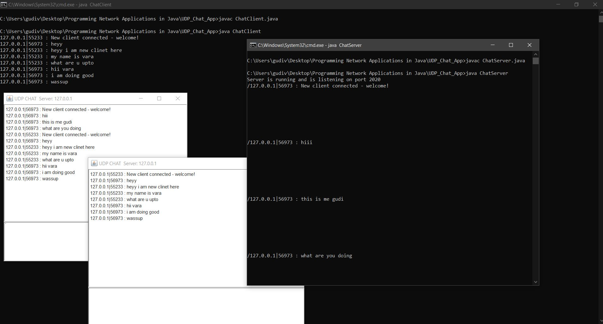

# A Simple UDP Chat :

> Download and test a very simple UDP chat!

## Instructions :

1. First, run ChatServer.java

2. Then, run ChatClient.java

3. You will be asked to enter the IP address of the Chat Server. If you're running both on the same host, you can enter 127.0.0.1.

4. Once you receive a "Welcome" message, you can run another Chat Client.

5. When you close a Client, nothing will happen (there will be no notifications) - and other Clients will continue to run.

> This is a very basic program - if you're savvy with Java, you can advance it to create something more interesting/complex!

## Output :

Have fun!

*Contributed by Gudi Varaprasad*

